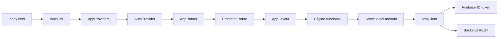
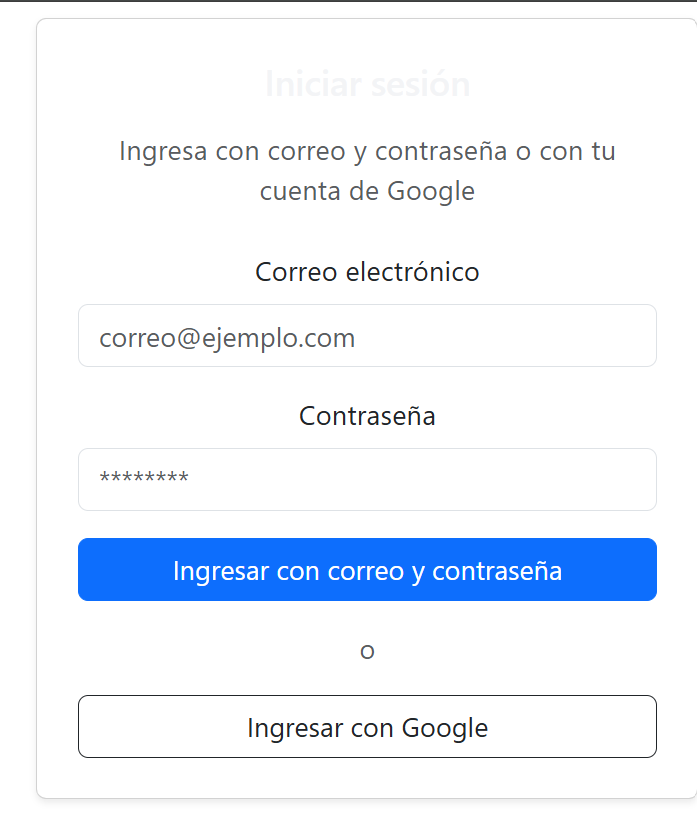
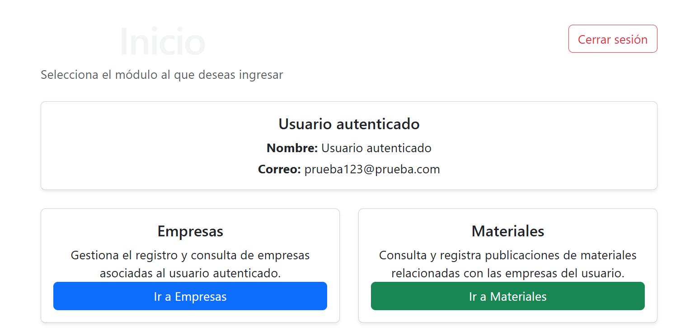
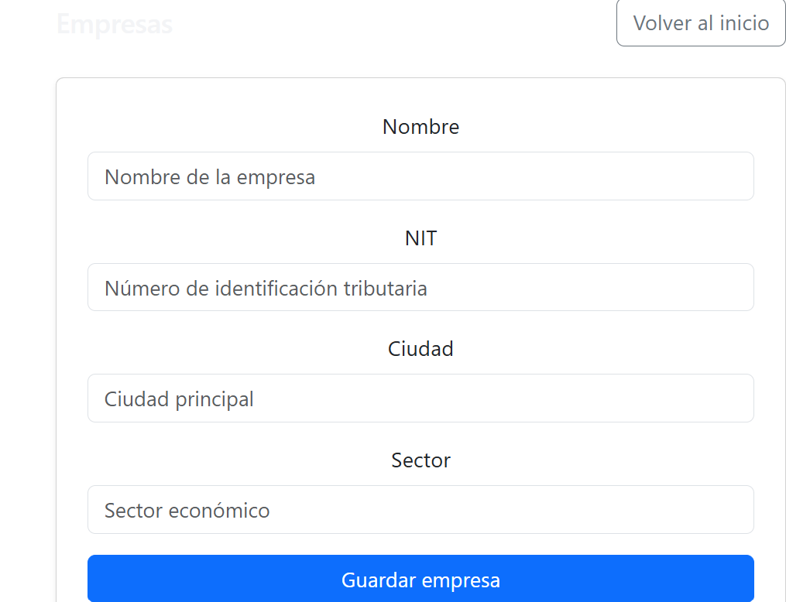
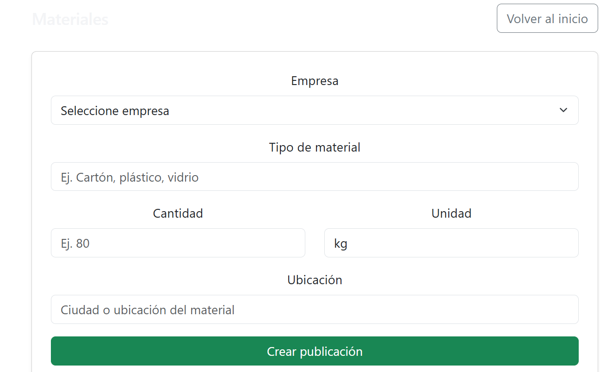

# D. Creación del frontend React refactorizado

[← C. Creación de backend](C-backend.md) | [Volver al README](../README.md) | [Siguiente: E. Despliegue local →](E-despliegue-local.md)

Esta guía reconstruye el frontend entregado con una arquitectura modular por funcionalidad. Conserva Firebase Authentication, los endpoints `/companies/` y `/materials/`, Bootstrap y la URL configurable del backend.

## 1. Propósito de la refactorización

La versión inicial ubicaba páginas, configuración, autenticación y acceso HTTP directamente en `src/`. La nueva estructura separa composición global, módulos funcionales, infraestructura compartida y configuración externa. El comportamiento visible se mantiene, pero se eliminan el token manual en `localStorage`, las recargas forzadas y el acoplamiento directo entre páginas y Axios.

## 2. Preparar el proyecto

Desde la raíz del repositorio, conserve una copia del frontend original y cree el proyecto de trabajo:

```bash
cp -R frontend frontend-respaldo
cd frontend
```

No copie `node_modules` al repositorio ni al archivo comprimido. Las dependencias se reconstruyen desde `package-lock.json`.

## 3. Instalar dependencias

```bash
npm install
```

Las dependencias funcionales son React, React Router, Axios, Firebase y Bootstrap. ESLint y Vite permanecen como dependencias de desarrollo.

## 4. Crear la estructura modular

```text
src/
├── app/
│   ├── App.jsx
│   ├── AppProviders.jsx
│   └── AppRouter.jsx
├── config/
│   ├── env.js
│   └── firebase.js
├── features/
│   ├── auth/
│   │   ├── components/LoginForm.jsx
│   │   ├── context/AuthProvider.jsx
│   │   ├── context/authContext.js
│   │   ├── hooks/useAuth.js
│   │   ├── pages/LoginPage.jsx
│   │   ├── routes/ProtectedRoute.jsx
│   │   └── services/authService.js
│   ├── companies/
│   │   ├── components/CompanyForm.jsx
│   │   ├── pages/CompaniesPage.jsx
│   │   └── services/companyService.js
│   ├── home/pages/HomePage.jsx
│   └── materials/
│       ├── components/MaterialForm.jsx
│       ├── components/MaterialList.jsx
│       ├── pages/MaterialsPage.jsx
│       └── services/materialService.js
├── shared/
│   ├── components/
│   ├── layouts/AppLayout.jsx
│   ├── pages/NotFoundPage.jsx
│   ├── services/httpClient.js
│   └── utils/getErrorMessage.js
├── styles/global.css
└── main.jsx
```

## 5. Configurar variables de entorno

Copie el archivo de ejemplo y complete los datos del proyecto Firebase existente:

```bash
cp .env.example .env
```

El archivo `.env` es local y no debe versionarse. Las variables `VITE_*` son accesibles desde el navegador y no deben contener secretos privados del backend.

## 6. Configuración general

### `.env.example`

Variables externas del backend y de Firebase.

```env
# URL base del backend. No debe terminar en barra.
VITE_API_URL=http://localhost:8000/api

# Configuración pública de la aplicación web registrada en Firebase.
# Los valores VITE_* quedan incluidos en el bundle del navegador; no almacenar secretos del servidor.
VITE_FIREBASE_API_KEY=
VITE_FIREBASE_AUTH_DOMAIN=
VITE_FIREBASE_PROJECT_ID=
VITE_FIREBASE_APP_ID=
```

### `.gitignore`

Exclusión de dependencias, artefactos y configuración local.

```gitignore
# Dependencias y compilados
node_modules/
dist/
dist-ssr/

# Variables de entorno locales
.env
.env.*
!.env.example

# Registros
logs/
*.log
npm-debug.log*
yarn-debug.log*
yarn-error.log*
pnpm-debug.log*
lerna-debug.log*

# Archivos locales y de editores
*.local
.vscode/*
!.vscode/extensions.json
.idea/
.DS_Store
*.suo
*.ntvs*
*.njsproj
*.sln
*.sw?
```

### `index.html`

Documento HTML que contiene el nodo raíz de React.

```html
<!doctype html>
<html lang="es">
  <head>
    <meta charset="UTF-8" />
    <link rel="icon" type="image/svg+xml" href="/favicon.svg" />
    <meta name="viewport" content="width=device-width, initial-scale=1.0" />
    <meta
      name="description"
      content="Frontend React para gestionar empresas y publicaciones de materiales."
    />
    <title>Gestión de empresas y materiales</title>
  </head>
  <body>
    <!-- React monta la aplicación completa dentro de este nodo. -->
    <div id="root"></div>
    <script type="module" src="/src/main.jsx"></script>
  </body>
</html>
```

### `vite.config.js`

Configuración de compilación con el plugin oficial de React.

```javascript
import { defineConfig } from "vite";
import react from "@vitejs/plugin-react";

/**
 * Configuración de Vite.
 *
 * El plugin oficial de React habilita la transformación de JSX y la
 * actualización rápida de componentes durante el desarrollo.
 */
export default defineConfig({
  plugins: [react()],
});
```

### `eslint.config.js`

Reglas de análisis estático para JavaScript, Hooks y React Refresh.

```javascript
import js from "@eslint/js";
import globals from "globals";
import reactHooks from "eslint-plugin-react-hooks";
import reactRefresh from "eslint-plugin-react-refresh";
import { defineConfig, globalIgnores } from "eslint/config";

/**
 * Reglas estáticas para JavaScript y JSX.
 *
 * Se ignoran artefactos generados y se activan las reglas recomendadas de
 * JavaScript, Hooks de React y React Refresh.
 */
export default defineConfig([
  globalIgnores(["dist", "coverage"]),
  {
    files: ["**/*.{js,jsx}"],
    extends: [
      js.configs.recommended,
      reactHooks.configs.flat.recommended,
      reactRefresh.configs.vite,
    ],
    languageOptions: {
      ecmaVersion: "latest",
      globals: globals.browser,
      parserOptions: {
        ecmaFeatures: { jsx: true },
        sourceType: "module",
      },
    },
    rules: {
      "no-unused-vars": ["error", { varsIgnorePattern: "^[A-Z_]" }],
    },
  },
]);
```

### `package.json`

Dependencias y scripts de desarrollo, validación y construcción.

```json
{
  "name": "frontend",
  "private": true,
  "version": "1.0.0",
  "type": "module",
  "scripts": {
    "dev": "vite",
    "build": "vite build",
    "lint": "eslint .",
    "preview": "vite preview",
    "check": "npm run lint && npm run build"
  },
  "dependencies": {
    "axios": "^1.15.0",
    "bootstrap": "^5.3.8",
    "firebase": "^12.12.0",
    "react": "^19.2.4",
    "react-dom": "^19.2.4",
    "react-router-dom": "^7.14.0"
  },
  "devDependencies": {
    "@eslint/js": "^9.39.4",
    "@types/react": "^19.2.14",
    "@types/react-dom": "^19.2.3",
    "@vitejs/plugin-react": "^6.0.1",
    "eslint": "^9.39.4",
    "eslint-plugin-react-hooks": "^7.0.1",
    "eslint-plugin-react-refresh": "^0.5.2",
    "globals": "^17.4.0",
    "vite": "^8.0.4"
  }
}
```

## 7. Punto de entrada y composición global

### `src/main.jsx`

Monta React e importa Bootstrap y los estilos globales.

```jsx
import { StrictMode } from "react";
import { createRoot } from "react-dom/client";
import "bootstrap/dist/css/bootstrap.min.css";
import "bootstrap/dist/js/bootstrap.bundle.min.js";
import "./styles/global.css";
import App from "./app/App.jsx";

/**
 * Punto de entrada del frontend.
 *
 * StrictMode activa verificaciones adicionales durante el desarrollo. Los
 * estilos globales se cargan una sola vez antes de montar la aplicación.
 */
createRoot(document.getElementById("root")).render(
  <StrictMode>
    <App />
  </StrictMode>,
);
```

### `src/app/App.jsx`

Componente raíz sin lógica de infraestructura.

```jsx
import AppProviders from "./AppProviders.jsx";
import AppRouter from "./AppRouter.jsx";

/**
 * Componente raíz.
 *
 * Mantiene separadas dos responsabilidades globales: los proveedores de
 * infraestructura y la definición de rutas.
 */
export default function App() {
  return (
    <AppProviders>
      <AppRouter />
    </AppProviders>
  );
}
```

### `src/app/AppProviders.jsx`

Registra BrowserRouter y AuthProvider.

```jsx
import { BrowserRouter } from "react-router-dom";
import AuthProvider from "../features/auth/context/AuthProvider.jsx";

/**
 * Registra los proveedores transversales de la aplicación.
 *
 * BrowserRouter administra la navegación del lado del cliente y AuthProvider
 * expone el estado de Firebase Authentication a todo el árbol de componentes.
 */
export default function AppProviders({ children }) {
  return (
    <BrowserRouter>
      <AuthProvider>{children}</AuthProvider>
    </BrowserRouter>
  );
}
```

### `src/app/AppRouter.jsx`

Centraliza rutas, protección, layout, alias y carga diferida.

```jsx
import { lazy, Suspense } from "react";
import { Navigate, Route, Routes } from "react-router-dom";
import ProtectedRoute from "../features/auth/routes/ProtectedRoute.jsx";
import useAuth from "../features/auth/hooks/useAuth.js";
import LoadingSpinner from "../shared/components/LoadingSpinner.jsx";
import AppLayout from "../shared/layouts/AppLayout.jsx";
import NotFoundPage from "../shared/pages/NotFoundPage.jsx";

// Las páginas se cargan únicamente cuando la ruta correspondiente se visita.
const LoginPage = lazy(() => import("../features/auth/pages/LoginPage.jsx"));
const HomePage = lazy(() => import("../features/home/pages/HomePage.jsx"));
const CompaniesPage = lazy(() =>
  import("../features/companies/pages/CompaniesPage.jsx"),
);
const MaterialsPage = lazy(() =>
  import("../features/materials/pages/MaterialsPage.jsx"),
);

/**
 * Decide el destino inicial una vez Firebase termina de restaurar la sesión.
 */
function RootRedirect() {
  const { user, loading } = useAuth();

  if (loading) {
    return <LoadingSpinner fullPage label="Verificando sesión" />;
  }

  return <Navigate to={user ? "/home" : "/login"} replace />;
}

/**
 * Mapa central de navegación.
 *
 * Las rutas funcionales se agrupan bajo ProtectedRoute y AppLayout. La ruta
 * histórica /company se conserva como alias para no romper enlaces previos.
 */
export default function AppRouter() {
  return (
    <Suspense fallback={<LoadingSpinner fullPage label="Cargando módulo" />}>
      <Routes>
        <Route path="/" element={<RootRedirect />} />
        <Route path="/login" element={<LoginPage />} />

        <Route element={<ProtectedRoute />}>
          <Route element={<AppLayout />}>
            <Route path="/home" element={<HomePage />} />
            <Route path="/companies" element={<CompaniesPage />} />
            <Route
              path="/company"
              element={<Navigate to="/companies" replace />}
            />
            <Route path="/materials" element={<MaterialsPage />} />
          </Route>
        </Route>

        <Route path="*" element={<NotFoundPage />} />
      </Routes>
    </Suspense>
  );
}
```

## 8. Configuración de entorno y Firebase

### `src/config/env.js`

Valida y normaliza las variables VITE_* requeridas.

```javascript
/**
 * Devuelve una variable obligatoria o detiene el arranque con un mensaje claro.
 */
function required(name, value) {
  const normalized = typeof value === "string" ? value.trim() : "";

  if (!normalized) {
    throw new Error(
      `[Configuración] Falta la variable ${name}. Revise el archivo .env.`,
    );
  }

  return normalized;
}

/**
 * Configuración tipada conceptualmente y centralizada.
 *
 * Se usan accesos estáticos a import.meta.env para que Vite pueda reemplazar
 * correctamente cada valor durante la compilación.
 */
export const env = Object.freeze({
  apiUrl: required("VITE_API_URL", import.meta.env.VITE_API_URL).replace(
    /\/+$/,
    "",
  ),
  firebase: Object.freeze({
    apiKey: required(
      "VITE_FIREBASE_API_KEY",
      import.meta.env.VITE_FIREBASE_API_KEY,
    ),
    authDomain: required(
      "VITE_FIREBASE_AUTH_DOMAIN",
      import.meta.env.VITE_FIREBASE_AUTH_DOMAIN,
    ),
    projectId: required(
      "VITE_FIREBASE_PROJECT_ID",
      import.meta.env.VITE_FIREBASE_PROJECT_ID,
    ),
    appId: required(
      "VITE_FIREBASE_APP_ID",
      import.meta.env.VITE_FIREBASE_APP_ID,
    ),
  }),
});
```

### `src/config/firebase.js`

Inicializa una única aplicación Firebase y el proveedor Google.

```javascript
import { getApp, getApps, initializeApp } from "firebase/app";
import { getAuth, GoogleAuthProvider } from "firebase/auth";
import { env } from "./env.js";

/**
 * Configuración única de Firebase.
 *
 * getApps evita inicializar una segunda instancia durante React Refresh. La
 * configuración proviene exclusivamente de variables VITE_*.
 */
const firebaseApp = getApps().length
  ? getApp()
  : initializeApp({
      apiKey: env.firebase.apiKey,
      authDomain: env.firebase.authDomain,
      projectId: env.firebase.projectId,
      appId: env.firebase.appId,
    });

export const auth = getAuth(firebaseApp);
export const googleProvider = new GoogleAuthProvider();

// Solicita al usuario escoger una cuenta en cada autenticación interactiva.
googleProvider.setCustomParameters({ prompt: "select_account" });

export { firebaseApp };
```

## 9. Módulo de autenticación

### `src/features/auth/context/authContext.js`

Define el contrato interno del contexto.

```javascript
import { createContext } from "react";

/**
 * Contrato interno del contexto de autenticación.
 *
 * El valor concreto se suministra desde AuthProvider y se consume únicamente
 * mediante useAuth para evitar accesos sin proveedor.
 */
const AuthContext = createContext(null);

export default AuthContext;
```

### `src/features/auth/context/AuthProvider.jsx`

Mantiene el usuario real y las operaciones globales de sesión.

```jsx
import { useEffect, useMemo, useState } from "react";
import AuthContext from "./authContext.js";
import {
  loginWithEmail as authenticateWithEmail,
  loginWithGoogle as authenticateWithGoogle,
  logout as closeSession,
  observeAuthState,
} from "../services/authService.js";

/**
 * Proveedor del estado global de autenticación.
 *
 * La sesión no se infiere a partir de una cadena guardada manualmente. Firebase
 * informa el usuario real mediante onAuthStateChanged y renueva sus tokens.
 */
export default function AuthProvider({ children }) {
  const [user, setUser] = useState(null);
  const [loading, setLoading] = useState(true);

  useEffect(() => {
    const unsubscribe = observeAuthState(
      (nextUser) => {
        setUser(nextUser);
        setLoading(false);
      },
      () => {
        setUser(null);
        setLoading(false);
      },
    );

    return unsubscribe;
  }, []);

  const value = useMemo(
    () => ({
      user,
      loading,
      isAuthenticated: Boolean(user),
      loginWithEmail: authenticateWithEmail,
      loginWithGoogle: authenticateWithGoogle,
      logout: closeSession,
    }),
    [loading, user],
  );

  return <AuthContext.Provider value={value}>{children}</AuthContext.Provider>;
}
```

### `src/features/auth/hooks/useAuth.js`

Expone un acceso seguro al contexto.

```javascript
import { useContext } from "react";
import AuthContext from "../context/authContext.js";

/**
 * Acceso seguro al contexto de autenticación.
 */
export default function useAuth() {
  const context = useContext(AuthContext);

  if (!context) {
    throw new Error("useAuth debe utilizarse dentro de AuthProvider.");
  }

  return context;
}
```

### `src/features/auth/services/authService.js`

Encapsula Firebase Authentication y la obtención del ID token.

```javascript
import {
  onAuthStateChanged,
  signInWithEmailAndPassword,
  signInWithPopup,
  signOut,
} from "firebase/auth";
import { auth, googleProvider } from "../../../config/firebase.js";

/**
 * Autentica un usuario mediante correo y contraseña.
 */
export async function loginWithEmail(email, password) {
  const credential = await signInWithEmailAndPassword(auth, email, password);
  return credential.user;
}

/**
 * Autentica un usuario mediante el proveedor de Google.
 */
export async function loginWithGoogle() {
  const credential = await signInWithPopup(auth, googleProvider);
  return credential.user;
}

/**
 * Finaliza la sesión administrada por Firebase.
 */
export function logout() {
  return signOut(auth);
}

/**
 * Suscribe la aplicación a los cambios reales de la sesión Firebase.
 */
export function observeAuthState(onChange, onError) {
  return onAuthStateChanged(auth, onChange, onError);
}

/**
 * Obtiene un ID token vigente para autenticar una llamada al backend.
 * Firebase renueva el token automáticamente cuando está próximo a expirar.
 */
export async function getCurrentIdToken() {
  return auth.currentUser ? auth.currentUser.getIdToken() : null;
}
```

### `src/features/auth/components/LoginForm.jsx`

Presenta los campos y delega la autenticación.

```jsx
import { useState } from "react";

const INITIAL_FORM = Object.freeze({
  email: "",
  password: "",
});

/**
 * Formulario presentacional de autenticación.
 *
 * Mantiene los campos controlados y delega la operación de Firebase a la página
 * contenedora mediante callbacks.
 */
export default function LoginForm({
  onEmailLogin,
  onGoogleLogin,
  isSubmitting,
}) {
  const [form, setForm] = useState(INITIAL_FORM);

  const handleChange = ({ target }) => {
    setForm((current) => ({
      ...current,
      [target.name]: target.value,
    }));
  };

  const handleSubmit = (event) => {
    event.preventDefault();
    onEmailLogin({
      email: form.email.trim(),
      password: form.password,
    });
  };

  return (
    <form onSubmit={handleSubmit} noValidate>
      <div className="mb-3 text-start">
        <label htmlFor="login-email" className="form-label">
          Correo electrónico
        </label>
        <input
          id="login-email"
          type="email"
          name="email"
          className="form-control"
          placeholder="correo@ejemplo.com"
          value={form.email}
          onChange={handleChange}
          autoComplete="email"
          required
          disabled={isSubmitting}
        />
      </div>

      <div className="mb-4 text-start">
        <label htmlFor="login-password" className="form-label">
          Contraseña
        </label>
        <input
          id="login-password"
          type="password"
          name="password"
          className="form-control"
          placeholder="********"
          value={form.password}
          onChange={handleChange}
          autoComplete="current-password"
          required
          disabled={isSubmitting}
        />
      </div>

      <div className="d-grid gap-3">
        <button type="submit" className="btn btn-primary" disabled={isSubmitting}>
          {isSubmitting ? "Autenticando…" : "Ingresar con correo y contraseña"}
        </button>

        <div className="text-center text-muted" aria-hidden="true">
          o
        </div>

        <button
          type="button"
          className="btn btn-outline-dark"
          onClick={onGoogleLogin}
          disabled={isSubmitting}
        >
          Ingresar con Google
        </button>
      </div>
    </form>
  );
}
```

### `src/features/auth/pages/LoginPage.jsx`

Coordina autenticación, errores y redirección.

```jsx
import { useState } from "react";
import { Navigate, useLocation, useNavigate } from "react-router-dom";
import AlertMessage from "../../../shared/components/AlertMessage.jsx";
import LoadingSpinner from "../../../shared/components/LoadingSpinner.jsx";
import { getErrorMessage } from "../../../shared/utils/getErrorMessage.js";
import LoginForm from "../components/LoginForm.jsx";
import useAuth from "../hooks/useAuth.js";

/**
 * Página pública de autenticación.
 *
 * Coordina el estado de envío, traduce errores técnicos y redirige al destino
 * que el usuario intentaba visitar antes de iniciar sesión.
 */
export default function LoginPage() {
  const { user, loading, loginWithEmail, loginWithGoogle } = useAuth();
  const location = useLocation();
  const navigate = useNavigate();
  const [isSubmitting, setIsSubmitting] = useState(false);
  const [errorMessage, setErrorMessage] = useState("");

  const destination = location.state?.from?.pathname ?? "/home";

  if (loading) {
    return <LoadingSpinner fullPage label="Restaurando sesión" />;
  }

  if (user) {
    return <Navigate to="/home" replace />;
  }

  const executeLogin = async (operation) => {
    setErrorMessage("");
    setIsSubmitting(true);

    try {
      await operation();
      navigate(destination, { replace: true });
    } catch (error) {
      setErrorMessage(
        getErrorMessage(error, "No fue posible iniciar sesión. Verifique sus datos."),
      );
    } finally {
      setIsSubmitting(false);
    }
  };

  const handleEmailLogin = ({ email, password }) =>
    executeLogin(() => loginWithEmail(email, password));

  const handleGoogleLogin = () => executeLogin(loginWithGoogle);

  return (
    <main className="auth-page">
      <section className="card shadow-sm auth-card" aria-labelledby="login-title">
        <div className="card-body p-4 p-md-5">
          <h1 id="login-title" className="h3 text-center mb-3">
            Iniciar sesión
          </h1>
          <p className="text-muted text-center mb-4">
            Ingresa con correo y contraseña o utiliza tu cuenta de Google.
          </p>

          <AlertMessage type="danger" message={errorMessage} />

          <LoginForm
            onEmailLogin={handleEmailLogin}
            onGoogleLogin={handleGoogleLogin}
            isSubmitting={isSubmitting}
          />
        </div>
      </section>
    </main>
  );
}
```

### `src/features/auth/routes/ProtectedRoute.jsx`

Restringe las rutas privadas según el usuario Firebase.

```jsx
import { Navigate, Outlet, useLocation } from "react-router-dom";
import LoadingSpinner from "../../../shared/components/LoadingSpinner.jsx";
import useAuth from "../hooks/useAuth.js";

/**
 * Guardia declarativa para rutas privadas.
 *
 * Espera a que Firebase determine el estado de sesión. Cuando no existe un
 * usuario, conserva la ubicación solicitada para regresar después del login.
 */
export default function ProtectedRoute() {
  const { user, loading } = useAuth();
  const location = useLocation();

  if (loading) {
    return <LoadingSpinner fullPage label="Verificando autorización" />;
  }

  if (!user) {
    return <Navigate to="/login" replace state={{ from: location }} />;
  }

  return <Outlet />;
}
```

## 10. Módulo de inicio

### `src/features/home/pages/HomePage.jsx`

Muestra el usuario y los accesos a módulos.

```jsx
import ModuleCard from "../../../shared/components/ModuleCard.jsx";
import useAuth from "../../auth/hooks/useAuth.js";

/**
 * Panel inicial del usuario autenticado.
 */
export default function HomePage() {
  const { user } = useAuth();
  const displayName = user?.displayName || "Usuario autenticado";

  return (
    <section aria-labelledby="home-title">
      <div className="mb-4">
        <h1 id="home-title" className="page-title">
          Inicio
        </h1>
        <p className="text-muted mb-0">
          Selecciona el módulo al que deseas ingresar.
        </p>
      </div>

      <article className="card shadow-sm mb-4">
        <div className="card-body text-center p-4">
          <h2 className="h4">Usuario autenticado</h2>
          <p className="mb-1">
            <strong>Nombre:</strong> {displayName}
          </p>
          <p className="mb-0">
            <strong>Correo:</strong> {user?.email ?? "No disponible"}
          </p>
        </div>
      </article>

      <div className="row g-4">
        <div className="col-md-6">
          <ModuleCard
            title="Empresas"
            description="Registra empresas asociadas al usuario autenticado y deja disponible la información para otros módulos."
            to="/companies"
            actionLabel="Ir a Empresas"
            variant="primary"
          />
        </div>

        <div className="col-md-6">
          <ModuleCard
            title="Materiales"
            description="Consulta y registra publicaciones de materiales relacionadas con las empresas disponibles."
            to="/materials"
            actionLabel="Ir a Materiales"
            variant="success"
          />
        </div>
      </div>
    </section>
  );
}
```

## 11. Módulo de empresas

### `src/features/companies/services/companyService.js`

Encapsula GET y POST de empresas.

```javascript
import httpClient from "../../../shared/services/httpClient.js";

const COMPANIES_ENDPOINT = "/companies/";

/**
 * Consulta las empresas visibles para el usuario autenticado.
 */
export async function listCompanies({ signal } = {}) {
  const response = await httpClient.get(COMPANIES_ENDPOINT, { signal });
  return response.data;
}

/**
 * Crea una empresa mediante el contrato actual del backend.
 */
export async function createCompany(company) {
  const response = await httpClient.post(COMPANIES_ENDPOINT, company);
  return response.data;
}
```

### `src/features/companies/components/CompanyForm.jsx`

Formulario controlado y desacoplado de Axios.

```jsx
import { useState } from "react";

const INITIAL_FORM = Object.freeze({
  name: "",
  nit: "",
  city: "",
  sector: "",
});

/**
 * Formulario reutilizable de empresas.
 *
 * La validación básica permanece en HTML y la persistencia se delega a la
 * página para que el componente no dependa directamente de Axios.
 */
export default function CompanyForm({ onSubmit }) {
  const [form, setForm] = useState(INITIAL_FORM);
  const [isSubmitting, setIsSubmitting] = useState(false);

  const handleChange = ({ target }) => {
    setForm((current) => ({
      ...current,
      [target.name]: target.value,
    }));
  };

  const handleSubmit = async (event) => {
    event.preventDefault();
    setIsSubmitting(true);

    try {
      await onSubmit({
        name: form.name.trim(),
        nit: form.nit.trim(),
        city: form.city.trim(),
        sector: form.sector.trim(),
      });
      setForm(INITIAL_FORM);
    } finally {
      setIsSubmitting(false);
    }
  };

  return (
    <form onSubmit={handleSubmit}>
      <div className="mb-3">
        <label htmlFor="company-name" className="form-label">
          Nombre
        </label>
        <input
          id="company-name"
          type="text"
          name="name"
          className="form-control"
          placeholder="Nombre de la empresa"
          value={form.name}
          onChange={handleChange}
          autoComplete="organization"
          required
          disabled={isSubmitting}
        />
      </div>

      <div className="mb-3">
        <label htmlFor="company-nit" className="form-label">
          NIT
        </label>
        <input
          id="company-nit"
          type="text"
          name="nit"
          className="form-control"
          placeholder="Número de identificación tributaria"
          value={form.nit}
          onChange={handleChange}
          inputMode="numeric"
          required
          disabled={isSubmitting}
        />
      </div>

      <div className="mb-3">
        <label htmlFor="company-city" className="form-label">
          Ciudad
        </label>
        <input
          id="company-city"
          type="text"
          name="city"
          className="form-control"
          placeholder="Ciudad principal"
          value={form.city}
          onChange={handleChange}
          autoComplete="address-level2"
          required
          disabled={isSubmitting}
        />
      </div>

      <div className="mb-4">
        <label htmlFor="company-sector" className="form-label">
          Sector
        </label>
        <input
          id="company-sector"
          type="text"
          name="sector"
          className="form-control"
          placeholder="Sector económico"
          value={form.sector}
          onChange={handleChange}
          required
          disabled={isSubmitting}
        />
      </div>

      <div className="d-grid">
        <button type="submit" className="btn btn-primary" disabled={isSubmitting}>
          {isSubmitting ? "Guardando…" : "Guardar empresa"}
        </button>
      </div>
    </form>
  );
}
```

### `src/features/companies/pages/CompaniesPage.jsx`

Coordina el caso de uso de creación y sus mensajes.

```jsx
import { useState } from "react";
import AlertMessage from "../../../shared/components/AlertMessage.jsx";
import PageHeader from "../../../shared/components/PageHeader.jsx";
import { getErrorMessage } from "../../../shared/utils/getErrorMessage.js";
import CompanyForm from "../components/CompanyForm.jsx";
import { createCompany } from "../services/companyService.js";

/**
 * Página contenedora del módulo de empresas.
 *
 * La página coordina el caso de uso y los mensajes; CompanyForm se concentra en
 * la interacción del usuario y companyService en la llamada HTTP.
 */
export default function CompaniesPage() {
  const [feedback, setFeedback] = useState(null);

  const handleCreateCompany = async (company) => {
    setFeedback(null);

    try {
      await createCompany(company);
      setFeedback({
        type: "success",
        message: "Empresa creada correctamente.",
      });
    } catch (error) {
      setFeedback({
        type: "danger",
        message: getErrorMessage(error, "No fue posible crear la empresa."),
      });
      throw error;
    }
  };

  return (
    <section aria-labelledby="companies-title">
      <PageHeader
        id="companies-title"
        title="Empresas"
        subtitle="Registra la información básica de una empresa."
      />

      <div className="row justify-content-center">
        <div className="col-lg-8">
          <AlertMessage type={feedback?.type} message={feedback?.message} />

          <article className="card shadow-sm">
            <div className="card-body p-4">
              <CompanyForm onSubmit={handleCreateCompany} />
            </div>
          </article>
        </div>
      </div>
    </section>
  );
}
```

## 12. Módulo de materiales

### `src/features/materials/services/materialService.js`

Encapsula GET y POST de materiales.

```javascript
import httpClient from "../../../shared/services/httpClient.js";

const MATERIALS_ENDPOINT = "/materials/";

/**
 * Consulta las publicaciones de materiales disponibles.
 */
export async function listMaterials({ signal } = {}) {
  const response = await httpClient.get(MATERIALS_ENDPOINT, { signal });
  return response.data;
}

/**
 * Crea una publicación de material.
 */
export async function createMaterial(material) {
  const response = await httpClient.post(MATERIALS_ENDPOINT, material);
  return response.data;
}
```

### `src/features/materials/components/MaterialForm.jsx`

Formulario de publicación asociado a una empresa.

```jsx
import { useState } from "react";

const INITIAL_FORM = Object.freeze({
  company_id: "",
  material_type: "",
  quantity: "",
  unit: "kg",
  location: "",
  status: "available",
});

/**
 * Formulario de publicación de materiales.
 */
export default function MaterialForm({ companies, onSubmit }) {
  const [form, setForm] = useState(INITIAL_FORM);
  const [isSubmitting, setIsSubmitting] = useState(false);

  const handleChange = ({ target }) => {
    setForm((current) => ({
      ...current,
      [target.name]: target.value,
    }));
  };

  const handleSubmit = async (event) => {
    event.preventDefault();
    setIsSubmitting(true);

    const companyId = /^\d+$/.test(form.company_id)
      ? Number(form.company_id)
      : form.company_id;

    try {
      await onSubmit({
        company_id: companyId,
        material_type: form.material_type.trim(),
        quantity: Number(form.quantity),
        unit: form.unit.trim(),
        location: form.location.trim(),
        status: form.status,
      });
      setForm(INITIAL_FORM);
    } finally {
      setIsSubmitting(false);
    }
  };

  const formDisabled = isSubmitting || companies.length === 0;

  return (
    <form onSubmit={handleSubmit}>
      <div className="mb-3">
        <label htmlFor="material-company" className="form-label">
          Empresa
        </label>
        <select
          id="material-company"
          name="company_id"
          className="form-select"
          value={form.company_id}
          onChange={handleChange}
          required
          disabled={formDisabled}
        >
          <option value="">Seleccione empresa</option>
          {companies.map((company) => (
            <option key={company.id} value={company.id}>
              {company.name}
            </option>
          ))}
        </select>
        {companies.length === 0 && (
          <div className="form-text">
            Registra primero una empresa para publicar materiales.
          </div>
        )}
      </div>

      <div className="mb-3">
        <label htmlFor="material-type" className="form-label">
          Tipo de material
        </label>
        <input
          id="material-type"
          type="text"
          name="material_type"
          className="form-control"
          placeholder="Ej. Cartón, plástico, vidrio"
          value={form.material_type}
          onChange={handleChange}
          required
          disabled={formDisabled}
        />
      </div>

      <div className="row">
        <div className="col-md-6 mb-3">
          <label htmlFor="material-quantity" className="form-label">
            Cantidad
          </label>
          <input
            id="material-quantity"
            type="number"
            name="quantity"
            className="form-control"
            placeholder="Ej. 80"
            value={form.quantity}
            onChange={handleChange}
            min="0.01"
            step="any"
            required
            disabled={formDisabled}
          />
        </div>

        <div className="col-md-6 mb-3">
          <label htmlFor="material-unit" className="form-label">
            Unidad
          </label>
          <input
            id="material-unit"
            type="text"
            name="unit"
            className="form-control"
            placeholder="Ej. kg"
            value={form.unit}
            onChange={handleChange}
            required
            disabled={formDisabled}
          />
        </div>
      </div>

      <div className="mb-4">
        <label htmlFor="material-location" className="form-label">
          Ubicación
        </label>
        <input
          id="material-location"
          type="text"
          name="location"
          className="form-control"
          placeholder="Ciudad o ubicación del material"
          value={form.location}
          onChange={handleChange}
          autoComplete="address-level2"
          required
          disabled={formDisabled}
        />
      </div>

      <div className="d-grid">
        <button type="submit" className="btn btn-success" disabled={formDisabled}>
          {isSubmitting ? "Creando…" : "Crear publicación"}
        </button>
      </div>
    </form>
  );
}
```

### `src/features/materials/components/MaterialList.jsx`

Representa la lista recibida del backend.

```jsx
/**
 * Lista presentacional de publicaciones de materiales.
 */
export default function MaterialList({ items }) {
  if (items.length === 0) {
    return (
      <p className="text-muted mb-0">No hay publicaciones registradas todavía.</p>
    );
  }

  return (
    <div className="list-group list-group-flush">
      {items.map((item) => (
        <article key={item.id} className="list-group-item px-0 py-3">
          <div className="d-flex justify-content-between gap-3 flex-wrap">
            <div>
              <h3 className="h6 mb-1">{item.material_type}</h3>
              <p className="mb-1">
                Cantidad: {item.quantity} {item.unit}
              </p>
              <small className="text-muted">Ubicación: {item.location}</small>
            </div>
            {item.status && (
              <span className="badge text-bg-light align-self-start">
                {item.status}
              </span>
            )}
          </div>
        </article>
      ))}
    </div>
  );
}
```

### `src/features/materials/pages/MaterialsPage.jsx`

Carga datos, crea publicaciones y actualiza la lista.

```jsx
import { useEffect, useState } from "react";
import { listCompanies } from "../../companies/services/companyService.js";
import AlertMessage from "../../../shared/components/AlertMessage.jsx";
import LoadingSpinner from "../../../shared/components/LoadingSpinner.jsx";
import PageHeader from "../../../shared/components/PageHeader.jsx";
import { getErrorMessage } from "../../../shared/utils/getErrorMessage.js";
import MaterialForm from "../components/MaterialForm.jsx";
import MaterialList from "../components/MaterialList.jsx";
import {
  createMaterial,
  listMaterials,
} from "../services/materialService.js";

/**
 * Página contenedora del módulo de materiales.
 *
 * Carga en paralelo las empresas y las publicaciones. AbortController evita
 * actualizar estado si el usuario abandona la ruta durante una petición.
 */
export default function MaterialsPage() {
  const [companies, setCompanies] = useState([]);
  const [items, setItems] = useState([]);
  const [loading, setLoading] = useState(true);
  const [feedback, setFeedback] = useState(null);

  useEffect(() => {
    const controller = new AbortController();

    const loadInitialData = async () => {
      setLoading(true);
      setFeedback(null);

      try {
        const [companyData, materialData] = await Promise.all([
          listCompanies({ signal: controller.signal }),
          listMaterials({ signal: controller.signal }),
        ]);

        setCompanies(Array.isArray(companyData) ? companyData : []);
        setItems(Array.isArray(materialData) ? materialData : []);
      } catch (error) {
        if (error.code !== "ERR_CANCELED") {
          setFeedback({
            type: "danger",
            message: getErrorMessage(
              error,
              "No fue posible cargar empresas y materiales.",
            ),
          });
        }
      } finally {
        if (!controller.signal.aborted) {
          setLoading(false);
        }
      }
    };

    loadInitialData();
    return () => controller.abort();
  }, []);

  const handleCreateMaterial = async (material) => {
    setFeedback(null);

    try {
      await createMaterial(material);
      const refreshedItems = await listMaterials();
      setItems(Array.isArray(refreshedItems) ? refreshedItems : []);
      setFeedback({
        type: "success",
        message: "Publicación creada correctamente.",
      });
    } catch (error) {
      setFeedback({
        type: "danger",
        message: getErrorMessage(
          error,
          "No fue posible crear la publicación de material.",
        ),
      });
      throw error;
    }
  };

  return (
    <section aria-labelledby="materials-title">
      <PageHeader
        id="materials-title"
        title="Materiales"
        subtitle="Registra y consulta publicaciones asociadas a una empresa."
      />

      <AlertMessage type={feedback?.type} message={feedback?.message} />

      {loading ? (
        <LoadingSpinner label="Cargando información" />
      ) : (
        <div className="row g-4">
          <div className="col-lg-7">
            <article className="card shadow-sm h-100">
              <div className="card-body p-4">
                <h2 className="h5 mb-4">Nueva publicación</h2>
                <MaterialForm
                  companies={companies}
                  onSubmit={handleCreateMaterial}
                />
              </div>
            </article>
          </div>

          <div className="col-lg-5">
            <article className="card shadow-sm h-100">
              <div className="card-body p-4">
                <h2 className="h5 mb-3">Publicaciones registradas</h2>
                <MaterialList items={items} />
              </div>
            </article>
          </div>
        </div>
      )}
    </section>
  );
}
```

## 13. Elementos compartidos

### `src/shared/services/httpClient.js`

Configura Axios y agrega un Bearer token vigente.

```javascript
import axios from "axios";
import { env } from "../../config/env.js";
import { getCurrentIdToken } from "../../features/auth/services/authService.js";

/**
 * Cliente HTTP único de la aplicación.
 *
 * Centraliza URL base, cabeceras, tiempo de espera y autenticación. Cada
 * servicio funcional solo declara el endpoint y el método HTTP que necesita.
 */
const httpClient = axios.create({
  baseURL: env.apiUrl,
  timeout: 15000,
  headers: {
    Accept: "application/json",
    "Content-Type": "application/json",
  },
});

httpClient.interceptors.request.use(
  async (config) => {
    const token = await getCurrentIdToken();

    if (token) {
      config.headers.Authorization = `Bearer ${token}`;
    }

    return config;
  },
  (error) => Promise.reject(error),
);

export default httpClient;
```

### `src/shared/utils/getErrorMessage.js`

Normaliza mensajes de backend, Firebase y red.

```javascript
/**
 * Extrae un mensaje legible de respuestas HTTP, errores de Firebase o fallos de
 * red sin acoplar los componentes a una estructura concreta del backend.
 */
export function getErrorMessage(error, fallback = "Ocurrió un error inesperado.") {
  const data = error?.response?.data;

  if (typeof data === "string" && data.trim()) {
    return data;
  }

  if (typeof data?.detail === "string") {
    return data.detail;
  }

  if (typeof data?.message === "string") {
    return data.message;
  }

  if (data && typeof data === "object") {
    const firstValue = Object.values(data).flat().find(Boolean);

    if (typeof firstValue === "string") {
      return firstValue;
    }
  }

  if (error?.code === "ERR_NETWORK") {
    return "No fue posible establecer comunicación con el backend.";
  }

  return fallback;
}
```

### `src/shared/components/AlertMessage.jsx`

Presenta mensajes accesibles.

```jsx
/**
 * Mensaje accesible y reutilizable para estados de éxito, error o información.
 */
export default function AlertMessage({ type = "info", message }) {
  if (!message) {
    return null;
  }

  return (
    <div className={`alert alert-${type}`} role="alert">
      {message}
    </div>
  );
}
```

### `src/shared/components/LoadingSpinner.jsx`

Presenta estados de carga.

```jsx
/**
 * Indicador de carga reutilizable.
 */
export default function LoadingSpinner({ label = "Cargando", fullPage = false }) {
  const className = fullPage
    ? "loading-container loading-container--full"
    : "loading-container";

  return (
    <div className={className} role="status" aria-live="polite">
      <div className="spinner-border text-primary" aria-hidden="true" />
      <span>{label}…</span>
    </div>
  );
}
```

### `src/shared/components/ModuleCard.jsx`

Presenta accesos homogéneos a módulos.

```jsx
import { Link } from "react-router-dom";

/**
 * Tarjeta reutilizable para presentar un módulo funcional en la página inicial.
 */
export default function ModuleCard({
  title,
  description,
  to,
  actionLabel,
  variant = "primary",
}) {
  return (
    <article className="card h-100 shadow-sm module-card">
      <div className="card-body d-flex flex-column p-4 text-center">
        <h2 className="h4">{title}</h2>
        <p className="text-muted flex-grow-1">{description}</p>
        <Link to={to} className={`btn btn-${variant}`}>
          {actionLabel}
        </Link>
      </div>
    </article>
  );
}
```

### `src/shared/components/PageHeader.jsx`

Normaliza encabezados funcionales.

```jsx
/**
 * Encabezado homogéneo para las páginas funcionales.
 */
export default function PageHeader({ id, title, subtitle }) {
  return (
    <header className="page-header mb-4">
      <h1 id={id} className="page-title">
        {title}
      </h1>
      {subtitle && <p className="text-muted mb-0">{subtitle}</p>}
    </header>
  );
}
```

### `src/shared/layouts/AppLayout.jsx`

Comparte navegación y cierre de sesión.

```jsx
import { NavLink, Outlet, useNavigate } from "react-router-dom";
import useAuth from "../../features/auth/hooks/useAuth.js";

/**
 * Estructura visual común para todas las rutas privadas.
 */
export default function AppLayout() {
  const { user, logout } = useAuth();
  const navigate = useNavigate();

  const handleLogout = async () => {
    await logout();
    navigate("/login", { replace: true });
  };

  const navClassName = ({ isActive }) =>
    `nav-link${isActive ? " active" : ""}`;

  return (
    <div className="app-shell">
      <nav className="navbar navbar-expand-lg bg-white border-bottom shadow-sm">
        <div className="container">
          <NavLink className="navbar-brand fw-semibold" to="/home">
            EcoRed Circular
          </NavLink>

          <button
            className="navbar-toggler"
            type="button"
            data-bs-toggle="collapse"
            data-bs-target="#main-navigation"
            aria-controls="main-navigation"
            aria-expanded="false"
            aria-label="Mostrar navegación"
          >
            <span className="navbar-toggler-icon" />
          </button>

          <div className="collapse navbar-collapse" id="main-navigation">
            <div className="navbar-nav me-auto">
              <NavLink className={navClassName} to="/home">
                Inicio
              </NavLink>
              <NavLink className={navClassName} to="/companies">
                Empresas
              </NavLink>
              <NavLink className={navClassName} to="/materials">
                Materiales
              </NavLink>
            </div>

            <div className="d-flex align-items-center gap-3 mt-3 mt-lg-0">
              <span className="small text-muted text-truncate user-email">
                {user?.email}
              </span>
              <button
                type="button"
                className="btn btn-outline-danger btn-sm"
                onClick={handleLogout}
              >
                Cerrar sesión
              </button>
            </div>
          </div>
        </div>
      </nav>

      <main className="container py-5">
        <Outlet />
      </main>
    </div>
  );
}
```

### `src/shared/pages/NotFoundPage.jsx`

Gestiona rutas inexistentes.

```jsx
import { Link } from "react-router-dom";

/**
 * Respuesta visual para rutas no definidas.
 */
export default function NotFoundPage() {
  return (
    <main className="auth-page text-center">
      <section className="card shadow-sm p-5">
        <h1 className="display-5">404</h1>
        <p className="text-muted">La página solicitada no existe.</p>
        <Link to="/" className="btn btn-primary">
          Volver al inicio
        </Link>
      </section>
    </main>
  );
}
```

### `src/styles/global.css`

Define la apariencia transversal y el comportamiento responsivo.

```css
:root {
  font-family:
    Inter, system-ui, -apple-system, BlinkMacSystemFont, "Segoe UI", sans-serif;
  color: #172b4d;
  background: #f6f8fb;
  font-synthesis: none;
  text-rendering: optimizeLegibility;
  -webkit-font-smoothing: antialiased;
  -moz-osx-font-smoothing: grayscale;
}

* {
  box-sizing: border-box;
}

html {
  min-width: 320px;
  min-height: 100%;
  background: #f6f8fb;
}

body {
  min-width: 320px;
  min-height: 100vh;
  margin: 0;
  background: #f6f8fb;
}

button,
input,
select {
  font: inherit;
}

.app-shell {
  min-height: 100vh;
}

.page-title {
  margin: 0 0 0.35rem;
  color: #172b4d;
  font-size: clamp(2rem, 5vw, 3.5rem);
  font-weight: 700;
  letter-spacing: -0.04em;
}

.page-header {
  max-width: 52rem;
}

.auth-page {
  min-height: 100vh;
  display: grid;
  place-items: center;
  padding: 2rem 1rem;
}

.auth-card {
  width: min(100%, 34rem);
}

.loading-container {
  min-height: 12rem;
  display: flex;
  align-items: center;
  justify-content: center;
  gap: 0.75rem;
  color: #5d6b82;
}

.loading-container--full {
  min-height: 100vh;
}

.module-card {
  transition:
    transform 160ms ease,
    box-shadow 160ms ease;
}

.module-card:hover {
  transform: translateY(-2px);
}

.navbar .nav-link.active {
  color: #0d6efd;
  font-weight: 600;
}

.user-email {
  max-width: 14rem;
}

.form-control,
.form-select,
.btn {
  min-height: 44px;
}

@media (max-width: 575.98px) {
  .page-title {
    font-size: 2rem;
  }

  .card-body {
    padding: 1.25rem !important;
  }
}
```

## 14. Flujo de ejecución



## 15. Probar el frontend

### 15.1 Iniciar desarrollo

```bash
npm run dev
```

Abra la URL que muestre Vite, normalmente `http://localhost:5173`.

### 15.2 Validar calidad y compilación

```bash
npm run lint
npm run build
# o en una sola instrucción
npm run check
```

### 15.3 Pruebas funcionales mínimas

1. Iniciar sesión con correo y contraseña.
2. Cerrar sesión y verificar la redirección a `/login`.
3. Iniciar sesión con Google.
4. Acceder directamente a `/companies` sin sesión y comprobar la protección.
5. Crear una empresa y verificar el mensaje de éxito.
6. Abrir Materiales, comprobar la carga de empresas y publicaciones.
7. Crear una publicación y verificar la actualización del listado.
8. Detener el backend y comprobar el mensaje de error de comunicación.

## 16. Pantallas funcionales de referencia

### Inicio de sesión



### Inicio y selección de módulo



### Registro de empresa



### Publicación de materiales



## 17. Correspondencia entre la versión original y la refactorizada

| Archivo original | Ubicación refactorizada |
|---|---|
| `src/App.jsx` | `src/app/App.jsx` y `src/app/AppRouter.jsx` |
| `src/api.js` | `src/shared/services/httpClient.js` |
| `src/firebaseConfig.js` | `src/config/firebase.js` |
| `src/LoginPage.jsx` | `src/features/auth/pages/LoginPage.jsx` |
| `src/ProtectedRoute.jsx` | `src/features/auth/routes/ProtectedRoute.jsx` |
| `src/HomePage.jsx` | `src/features/home/pages/HomePage.jsx` |
| `src/CompanyPage.jsx` | `src/features/companies/pages/CompaniesPage.jsx` |
| `src/MaterialsPage.jsx` | `src/features/materials/pages/MaterialsPage.jsx` |
| `src/index.css` | `src/styles/global.css` |
| `src/App.css` y assets sin uso | Eliminados del runtime |

## 18. Evidencia Twelve-Factor transversal

- **Factor I. Codebase**: el frontend permanece dentro de una única base de código versionada.
- **Factor II. Dependencies**: `package.json` declara dependencias y `package-lock.json` fija la resolución reproducible.
- **Factor III. Config**: URL del backend y configuración Firebase se externalizan mediante variables `VITE_*`.
- **Factor IV. Backing services**: Firebase Authentication y el backend REST se consumen como recursos conectados por configuración.
- **Factor V. Build, release, run**: `npm run build` genera el artefacto y `npm run preview` permite validarlo antes de desplegar.
- **Factor VII. Port binding**: Vite sirve el frontend mediante un puerto local configurable.
- **Factor XI. Logs**: los errores técnicos pueden observarse en consola durante desarrollo; los mensajes al usuario se normalizan sin exponer detalles internos.

## 19. Resultado esperado

La aplicación debe iniciar sin almacenar manualmente tokens, proteger rutas según Firebase, consumir el backend con un ID token vigente y mantener separadas las responsabilidades de interfaz, estado, autenticación y acceso HTTP.
